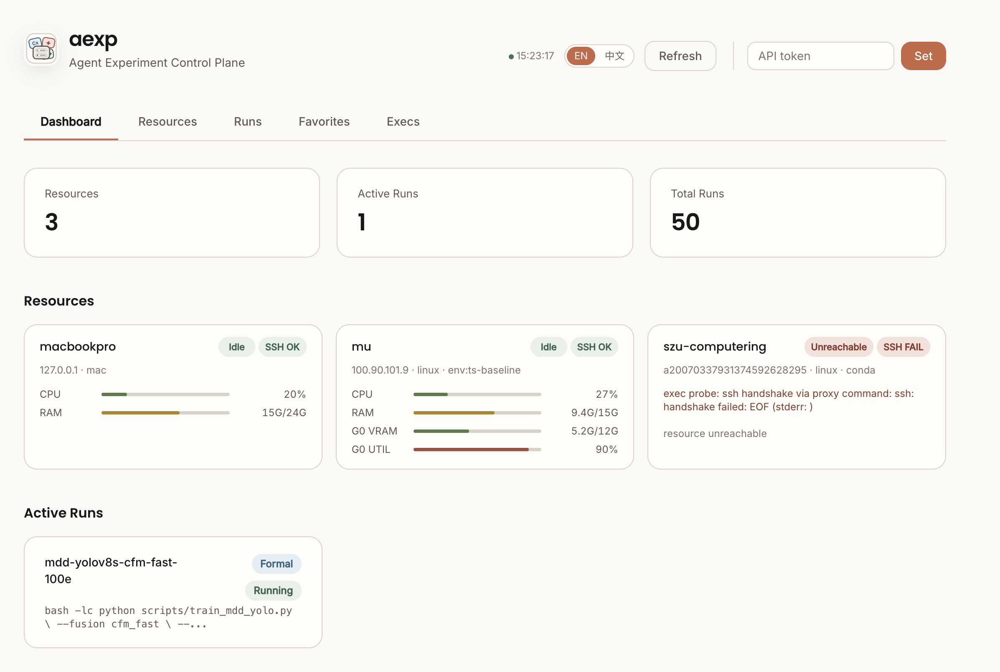
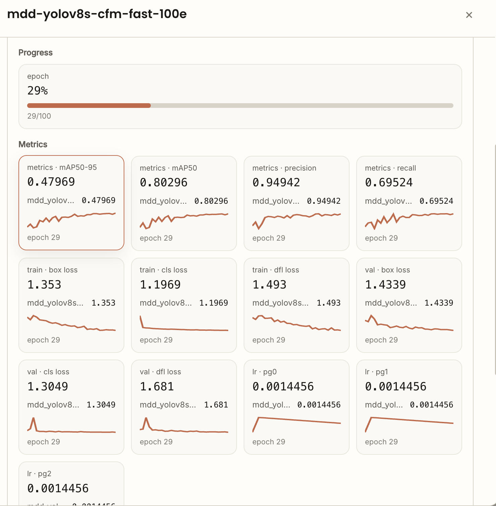
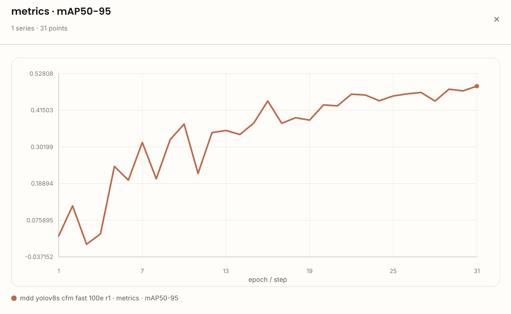

# aexp

Agent-friendly experiment control for SSH machines.

`aexp` gives humans and coding agents a small control plane for running research
experiments on remote GPU boxes. It keeps the convenience of SSH, but adds run
records, tmux-backed execution, live logs, resource monitoring, structured
metrics, and an audit trail.



## Why aexp?

Research experiments often start as a pile of SSH sessions, `nohup` commands,
tmux panes, copied log paths, and half-remembered GPU state. That is painful for
humans and worse for agents: once the chat or terminal session changes, the
agent no longer knows what was submitted, where the logs are, or whether a run
is still alive.

`aexp` makes those actions explicit:

| Need | With raw SSH | With aexp |
|---|---|---|
| Run a quick inspection command | `ssh host ...` | `aexp exec --resource gpu -- ...` |
| Start a long experiment | manual `tmux` / `nohup` | `aexp run submit ...` |
| Find logs later | remember paths | `aexp run logs <run_id>` |
| See GPU/CPU/RAM | run remote commands | Web dashboard and resource snapshots |
| Resume after context loss | reconstruct from shell history | query runs, events, metrics, and marks |
| Keep setup/smoke/formal runs separate | naming convention | first-class `--kind setup|smoke|formal|ablation` |

Today `aexp` targets SSH resources. The schema leaves room for Docker, Slurm,
Kubernetes, and local execution, but the open-source path is intentionally
simple: one local binary, one SQLite database, remote machines with SSH + tmux.

## What It Does

- Register SSH resources with root directories, default Conda environments, GPU
  labels, SOCKS proxies, or ProxyCommand.
- Submit long-running runs into deterministic remote tmux sessions.
- Capture stdout, stderr, exit code, timestamps, and live terminal logs.
- Follow logs from CLI or browser while the run is still active.
- Run short one-shot commands without creating a formal run record.
- Discover project runtime profiles: `.venv`, `uv run`, Conda, Python, Torch,
  CUDA, candidate logs, and candidate metric files.
- Sync local project files to a resource with rsync.
- Emit JSONL UI events from scripts for progress, params, notes, and metrics.
- Store resources, runs, events, marks, and history in local SQLite.

## Install

### Binary Release

```bash
curl -fsSL https://raw.githubusercontent.com/ziwu/aexp/main/scripts/install.sh | sh
aexp --help
```

The installer downloads the latest GitHub Release for your OS/architecture and
installs `aexp` plus the `aexp-event` helper into `~/.local/bin`.

To install a specific version or directory:

```bash
AEXP_VERSION=v0.1.0 sh -c "$(curl -fsSL https://raw.githubusercontent.com/ziwu/aexp/main/scripts/install.sh)"
AEXP_INSTALL_DIR=/usr/local/bin sh -c "$(curl -fsSL https://raw.githubusercontent.com/ziwu/aexp/main/scripts/install.sh)"
```

### From Source

```bash
git clone https://github.com/ziwu/aexp.git
cd aexp
go build -o aexp ./cmd/aexp
./aexp --help
```

Remote machines do not need `aexp`. They need:

- SSH access from your local machine
- `bash`
- `tmux`
- your experiment runtime, such as Python, uv, Conda, CUDA, or project scripts
- optional: `rsync` for project sync

## Quick Start

Initialize local state and start the local dashboard:

```bash
aexp init
aexp serve --port 8080
```

Open `http://localhost:8080`.


If you use Codex or Claude Code, install the MCP tools:

```bash
aexp mcp install --target all
```

The MCP tools let agents call `aexp_exec`, `aexp_submit_run`,
`aexp_project_run`, `aexp_sync_push`, `aexp_mark_run`, and the rest of the
structured surface without hand-editing MCP JSON/TOML.

Explore a remote host before registering it:

```bash
aexp resource explore 192.168.1.100 --user root
```

Add a resource:

```bash
aexp resource add \
  --name gpu-box \
  --host 192.168.1.100 \
  --user root \
  --root-dir /workspace \
  --conda-env research \
  --gpu-indices 0
```

You can also add resources in the browser:


Run a quick inspection command:

```bash
aexp exec --resource gpu-box -- nvidia-smi
aexp exec --resource gpu-box --cwd /workspace/project --project-env auto -- 'python -V'
```

Submit a tracked experiment:

```bash
aexp run submit \
  --resource gpu-box \
  --name ecl-itransformer \
  --kind formal \
  --cwd /workspace/Time-Series-Library \
  --project-env auto \
  --gpu-index 0 \
  --log-paths 'logs/**/*.log' \
  --metric-paths 'results/**/*.json' \
  -- python train.py --data ECL --model iTransformer
```

Watch it:

```bash
aexp run list
aexp run status run_xxx --short
aexp run logs run_xxx --follow
```

The Runs page shows run kind, status, GPU, command, favorite/trash actions, and
highlighted findings:


Localhost access is token-free by default. If you bind to a non-local address,
remote browser/API access requires the API token printed by the server.

## Common Workflows

### One-Shot Remote Checks

Use `exec` for bounded inspection and operations. It does not create a run.

```bash
aexp exec --resource gpu-box -- 'df -h /workspace'
aexp exec --resource gpu-box --json -- 'du -sh /workspace/.aexp/runs/*'
aexp exec --resource gpu-box --timeout 120 -- 'find /workspace -name "*.pt" | wc -l'
```

If a command looks like a training job, `aexp exec` refuses it unless you pass
`--force`. Use `run submit` for long-running experiments.

### Long-Running Experiments

`run submit` creates a durable run:

- a local SQLite record
- a remote directory under `<root-dir>/.aexp/runs/<run_id>`
- a remote `command.sh`
- a deterministic tmux session named `aexp_<run_id>`
- stdout/stderr/terminal logs
- exit status and timestamps

Structured argv mode is the default:

```bash
aexp run submit --resource gpu-box -- python train.py --epochs 20
```

Use shell mode only when you need shell syntax:

```bash
aexp run submit \
  --resource gpu-box \
  --shell -- 'echo start; python train.py 2>&1 | tee train.log'
```

Use run kinds deliberately:

```bash
aexp run submit --kind setup --no-gpu --resource gpu-box --shell -- 'uv sync'
aexp run submit --kind smoke --resource gpu-box -- python train.py --epochs 1
aexp run submit --kind formal --resource gpu-box -- python train.py --epochs 100
```

Smoke runs are connectivity or wiring checks. Do not treat them as experimental
results.

### Project Configs

For repeated project work, put resource, cwd, sync settings, and recipes in a
project-local `.aexp.yaml`.

```bash
aexp project init --resource gpu-box --cwd /workspace/project
aexp project doctor
aexp project sync --dry-run
aexp project sync
aexp project run setup --dry-run
aexp project run train
```

See [examples/python-ml](examples/python-ml) for a minimal project layout.

### Structured Metrics and Progress

Inside a submitted run, `aexp` sets `AEXP_RUN_ID`, `AEXP_RUN_DIR`, and
`AEXP_UI_EVENTS`. Python scripts can write structured JSONL events with the
generated helper:

```python
from aexp_events import metric, progress, param, note

param("model", "iTransformer")
progress("epoch", current=1, total=20)
metric("val/loss", 0.123, step=1)
note("first checkpoint written")
```

The dashboard renders these events as progress cards, metric cards, and charts.



Runs that emit the same metric names can be compared on one chart:



### Web Dashboard

The dashboard is embedded in the Go binary. There is no frontend build step.


It includes:

- resource cards with CPU/RAM/GPU snapshots
- run list and run details
- live stdout/stderr/terminal logs
- structured progress and metrics
- agent findings and run marks


Agents and humans can attach lightweight findings to important runs. Highlighted
runs stay visible in the list and the finding text remains attached to the run:


## CLI Overview

```text
aexp init
aexp serve [--port 8080] [--daemon]
aexp mcp
aexp mcp install [--target codex|claude|all]
aexp mcp uninstall [--target codex|claude|all]

aexp resource explore <host>
aexp resource add --name <name> --host <host> --root-dir <dir>
aexp resource list [--json] [--verbose]
aexp resource update <name> ...
aexp resource remove <name>

aexp exec --resource <name> -- <command>
aexp run submit --resource <name> [flags] -- <program> [args...]
aexp run list [--json]
aexp run status <run_id> [--short] [--json]
aexp run logs <run_id> [--follow] [--source stdout|stderr]
aexp run cancel <run_id>
aexp run mark <run_id> --title ... --reason ... --evidence ...

aexp project init
aexp project doctor
aexp project sync
aexp project run <recipe>

aexp sync doctor --resource <name> <source> <target>
aexp sync push --resource <name> <source> <target>
aexp sync pull --resource <name> <source> <target>
```

For the full command reference, see [USAGE.md](USAGE.md).

## MCP For Agents

`aexp` can run as a stdio MCP server:

```bash
aexp mcp
```

To register it with local agent clients:

```bash
# Install/update both Codex and Claude Code MCP configs.
aexp mcp install --target all

# Or install one client only.
aexp mcp install --target codex
aexp mcp install --target claude

# Remove the generated config.
aexp mcp uninstall --target all
```

The installer uses the clients' own MCP CLIs (`codex mcp ...` and
`claude mcp ...`) and manages only the server named `aexp`. By default it
points the MCP server at the current `aexp` binary and sets
`AEXP_API_URL=http://127.0.0.1:8080/api/v1`.

The MCP server exposes structured tools for agents:

- `aexp_agent_card`
- `aexp_init`
- `aexp_project_init`
- `aexp_list_resources`
- `aexp_doctor`
- `aexp_resource_explore`
- `aexp_resource_add`
- `aexp_resource_add_local`
- `aexp_resource_update`
- `aexp_resource_remove`
- `aexp_exec`
- `aexp_submit_run`
- `aexp_list_runs`
- `aexp_refresh_runs`
- `aexp_get_run_status`
- `aexp_tail_run_logs`
- `aexp_cancel_run`
- `aexp_mark_run`
- `aexp_list_run_marks`
- `aexp_exec_history`
- `aexp_exec_show`
- `aexp_event_metric`
- `aexp_event_progress`
- `aexp_event_param`
- `aexp_event_note`
- `aexp_project_detect`
- `aexp_project_doctor`
- `aexp_project_run`
- `aexp_project_sync`
- `aexp_sync_doctor`
- `aexp_sync_push`
- `aexp_sync_pull`
- `aexp_sync_remote_pull`
- `aexp_cli`

The current implementation wraps the local `aexp` binary instead of duplicating
executor logic. That keeps behavior identical to the CLI: short commands still
use `aexp exec`, including the local API fast path that can reuse a warm
`aexp serve` SSH pool, while long tasks go through tracked `run submit`.
`aexp_cli` is deliberately restricted to read-only commands; use the dedicated
tools for exec, submit, cancel, sync, resources, projects, and marks. Agents
should not need to fall back to raw CLI for normal aexp operations.

## Data Model

`aexp` stores its local control-plane state in SQLite:

```text
~/.aexp/aexp.db
```

Remote run files live under the registered resource root:

```text
<root-dir>/.aexp/runs/<run_id>/
  command.sh
  status
  exit_code
  started_at
  finished_at
  logs/
    stdout.log
    stderr.log
    terminal.log
```

## Safety Model

`aexp` is a personal or small-team research tool, not a multi-tenant scheduler.

- It executes commands as the SSH user you configured.
- `--cwd` is constrained under the resource `root_dir` for aexp-managed paths.
- Dangerous command patterns such as `rm -rf /` are rejected.
- Localhost browser access is convenient by default; remote access requires the
  API token.
- Binding `aexp serve --host 0.0.0.0` exposes the service. Put it behind SSH,
  a VPN, or another trusted access layer.

## Documentation

- [USAGE.md](USAGE.md): full user guide and command examples
- [docs/concepts.md](docs/concepts.md): resources, runs, snapshots, events
- [docs/development.md](docs/development.md): architecture, implementation notes, module map
- [docs/deployment.md](docs/deployment.md): daemon and deployment notes
- [docs/testing.md](docs/testing.md): build and smoke testing workflow
- [docs/mod-security.md](docs/mod-security.md): security boundaries
- [docs/mod-api.md](docs/mod-api.md): REST and WebSocket API
- [docs/mod-agent.md](docs/mod-agent.md): MCP tool surface

## Development

```bash
go test ./...
go build -o aexp ./cmd/aexp
```

This repository intentionally keeps the binary self-contained: Go backend,
embedded HTML/CSS/JS dashboard, SQLite storage, and no Node build pipeline.

## Status

`aexp` is early-stage software built from real research workflow pain. It is
useful today for SSH-based experiment tracking, but expect rough edges around
multi-user deployments, non-SSH backends, and integration with external
experiment trackers.

Contributions that improve reliability, documentation, provider support, and
agent-oriented workflows are welcome.
