# aexp

[](https://go.dev/)
[](https://github.com/murasame612/aexp/releases)
[](https://github.com/murasame612/aexp/releases)

[English](README.md) | [中文](README_zh.md)

Agent-friendly research experiment and evidence control for SSH machines.

`aexp` gives humans and coding agents a small control plane for running research
experiments on remote GPU boxes. It keeps the convenience of SSH, but adds run
records, tmux-backed execution, live logs, resource monitoring, structured
metrics, and an audit trail.

The normal research model has four concepts:

```text
Project
├── Assets
├── Runs
└── Evidence Maps
    ├── Primary (default inbox)
    └── Topic graphs (optional)
```

An immutable Asset revision is used by a Run; verified Run outputs can be
referenced by an Evidence Snapshot, evaluated by the Project Release gate, and
then cited by an Evidence proposal. NAS, transfers, placements, and bindings
remain inspectable implementation details under Settings; agents do not
orchestrate them in the normal workflow.

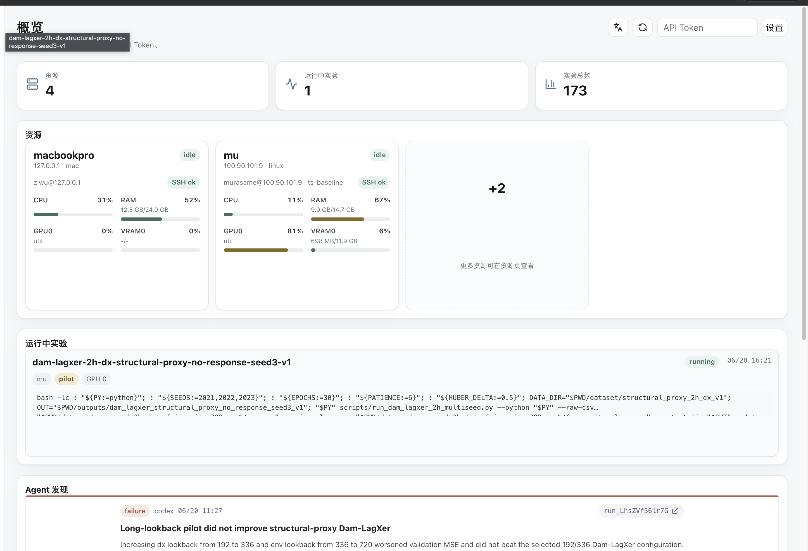

## Why aexp?

Research experiments often start as a pile of SSH sessions, `nohup` commands,
tmux panes, copied log paths, and half-remembered GPU state. That is painful for
humans and worse for agents: once the chat or terminal session changes, the
agent no longer knows what was submitted, where the logs are, or whether a run
is still alive.

`aexp` makes those actions explicit:

| Need | With raw SSH | With aexp |
|---|---|---|
| Run a quick inspection command | `ssh host ...` | `aexp exec --resource gpu -- ...` |
| Start a long experiment | manual `tmux` / `nohup` | `aexp run submit ...` |
| Find logs later | remember paths | `aexp run logs <run_id>` |
| See GPU/CPU/RAM | run remote commands | Web dashboard and resource snapshots |
| Resume after context loss | reconstruct from shell history | query runs, events, metrics, and marks |
| Keep task/evidence/experiment roles separate | naming convention | `task_role`, `evidence_grade`, and `experiment_role` (legacy `--kind` remains compatible) |

Today `aexp` targets SSH resources. The schema leaves room for Docker, Slurm,
Kubernetes, and local execution, but the open-source path is intentionally
simple: one local binary, one SQLite database, remote machines with SSH + tmux.

## What It Does

- Register SSH resources with root directories, default Conda environments, GPU
  labels, SOCKS proxies, or ProxyCommand.
- Submit long-running runs into deterministic remote tmux sessions.
- Capture stdout, stderr, exit code, timestamps, and live terminal logs.
- Follow logs from CLI or browser while the run is still active.
- Run short one-shot commands without creating a formal run record.
- Discover project runtime profiles: `.venv`, `uv run`, Conda, Python, Torch,
  CUDA, candidate logs, and candidate metric files.
- Define executable Projects and per-resource Targets in the ui-v2 Launchpad,
  inspect a prepare plan, and launch preparation as a tracked setup run.
- Sync local project files to a resource with rsync.
- Emit JSONL UI events from scripts for progress, params, notes, and metrics.
- Capture a versioned, hashed Run Manifest and index declared remote artifacts
  without downloading large checkpoints automatically.
- Check run comparability, aggregate structured metrics by seed, and generate a
  provenance-bounded Markdown comparison report.
- Bind a Project to one Zotero collection and query a read-only PaperQA2
  projection without storing PDFs, chunks, embeddings, or service secrets in
  the aexp database. The binding is the reproducible project-first default,
  not a boundary on read-only Zotero discovery; live references are pinned by
  Zotero item/library version when written to the Journal. Literature remains
  background evidence and cannot satisfy experiment provenance gates.
- Store resources, projects, targets, runs, events, marks, and history in local SQLite.

## Install

### Binary Release

```bash
curl -fsSL https://raw.githubusercontent.com/murasame612/aexp/main/scripts/install.sh | sh
aexp --help
```

The installer downloads the latest GitHub Release for your OS/architecture and
installs `aexp` plus the legacy/debug `aexp-event` compatibility entrypoint into
`~/.local/bin`.

To install a specific version or directory:

```bash
AEXP_VERSION=v0.2.0 sh -c "$(curl -fsSL https://raw.githubusercontent.com/murasame612/aexp/main/scripts/install.sh)"
AEXP_INSTALL_DIR=/usr/local/bin sh -c "$(curl -fsSL https://raw.githubusercontent.com/murasame612/aexp/main/scripts/install.sh)"
```

Update or uninstall later:

```bash
aexp update
aexp update --stop-serve
aexp uninstall --yes
aexp uninstall --yes --purge-data
```

`aexp update` downloads the matching GitHub Release asset, verifies
`checksums.txt`, smoke-tests the new binary, backs up the old binary, and
recreates the `aexp-event` compatibility entrypoint. `aexp uninstall` removes
the binary and MCP client config by default; it keeps `~/.aexp` unless
`--purge-data` is explicitly passed.

### From Source

```bash
git clone https://github.com/murasame612/aexp.git
cd aexp
go build -o aexp ./cmd/aexp
./aexp --help
```

Remote machines do not need `aexp`. They need:

- SSH access from your local machine
- `bash`
- `tmux`
- your experiment runtime, such as Python, uv, Conda, CUDA, or project scripts
- optional: `rsync` for project sync

## Quick Start

Initialize local state and start the local dashboard:

```bash
aexp init
aexp serve --port 8080
```

Open the UI you want:

| UI | URL | Use it for |
|---|---|---|
| React UI v2 | `http://localhost:8080/ui-v2/` | the main Project experience: Overview, paginated Runs, Assets, and the Project's primary plus optional topic Evidence Maps |
| Legacy UI | `http://localhost:8080/` | the embedded compatibility dashboard for older workflows, quick debugging, or installations that still depend on the root path |

The two UIs use the same local `aexp` API and SQLite database. You can switch
between them without migrating data.


If you use Codex, Claude Code, or Hermes Agent, install the MCP tools:

```bash
aexp mcp install --target all
```

The default MCP surface is intentionally small: inspect Projects, publish and
read Assets, submit and inspect Runs, create Snapshots, evaluate Releases, and
submit reviewable Evidence proposals. Legacy storage/transfer tools remain
callable for administrator compatibility but are not advertised as the normal
research workflow.

Explore a remote host before registering it:

```bash
aexp resource explore 192.168.1.100 --user root
```

Add a resource:

```bash
aexp resource add \
  --name gpu-box \
  --host 192.168.1.100 \
  --user root \
  --root-dir /workspace \
  --conda-env research \
  --gpu-indices 0
```

You can also add resources in the browser:

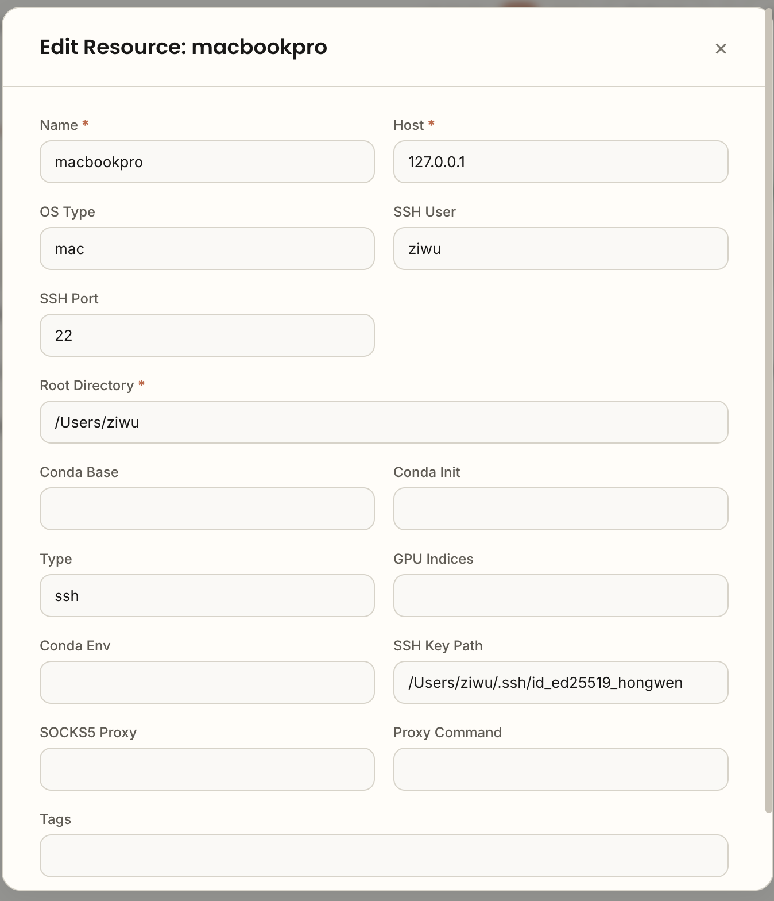

Run a quick inspection command:

```bash
aexp exec --resource gpu-box -- nvidia-smi
aexp exec --resource gpu-box --cwd /workspace/project --project-env auto -- 'python -V'
```

Submit a tracked experiment:

```bash
aexp run submit \
  --resource gpu-box \
  --name ecl-itransformer \
  --kind formal \
  --cwd /workspace/Time-Series-Library \
  --project-env auto \
  --gpu-index 0 \
  --dataset ecl@v1 \
  --seed 41 --seed 42 --seed 43 \
  --config-sha256 'sha256:<project-config-digest>' \
  --split-protocol ecl-split-v1 \
  --evaluation-protocol forecasting-eval-v1 \
  --log-paths 'logs/**/*.log' \
  --metric-paths 'results/**/*.json' \
  -- python train.py --data ECL --model iTransformer
```

Formal and ablation runs require a dataset published and verified by
`aexp dataset ingest`; metadata-only `dataset register` entries cannot become
paper evidence. Project recipes calculate the project-config digest
automatically.

Watch it:

```bash
aexp run list
aexp run snapshot run_xxx --json
aexp run events run_xxx --tail 50 --json
aexp run logs run_xxx --tail 100
```

The Runs page shows run kind, status, GPU, command, favorite/trash actions, and
highlighted findings:

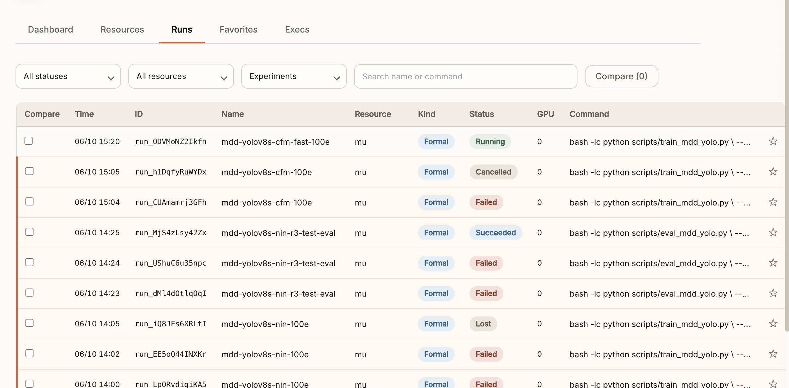

Localhost access is token-free by default. If you bind to a non-local address,
remote browser/API access requires the API token printed by the server.

## Common Workflows

### One-Shot Remote Checks

Use `exec` for bounded inspection and operations. It does not create a run.

```bash
aexp exec --resource gpu-box -- 'df -h /workspace'
aexp exec --resource gpu-box --json -- 'du -sh /workspace/.aexp/runs/*'
aexp exec --resource gpu-box --timeout 120 -- 'find /workspace -name "*.pt" | wc -l'
```

If a command looks like a training job, `aexp exec` refuses it unless you pass
`--force`. Use `run submit` for long-running experiments.

### Long-Running Experiments

`run submit` creates a durable run:

- a local SQLite record
- a remote directory under `<root-dir>/.aexp/runs/<run_id>`
- a remote `command.sh`
- a deterministic tmux session named `aexp_<run_id>`
- stdout/stderr/terminal logs
- exit status and timestamps

Structured argv mode is the default:

```bash
aexp run submit --resource gpu-box --project my-project -- python train.py --epochs 20
```

Use shell mode only when you need shell syntax:

```bash
aexp run submit \
  --resource gpu-box \
  --project my-project \
  --shell -- 'echo start; python train.py 2>&1 | tee train.log'
```

Use run kinds deliberately:

```bash
aexp run submit --kind setup --no-gpu --resource gpu-box --shell -- 'uv sync'
aexp run submit --kind smoke --resource gpu-box -- python train.py --epochs 1
aexp run submit --kind formal --resource gpu-box \
  --dataset project-data@v1 --seed 41 \
  --config-sha256 'sha256:<project-config-digest>' \
  --split-protocol split-v1 --evaluation-protocol eval-v1 \
  -- python train.py --epochs 100
```

Smoke runs are connectivity or wiring checks. Do not treat them as experimental
results.

### Project Configs

For repeated project work, put resource, cwd, sync settings, and recipes in a
project-local `.aexp.yaml`.

```bash
aexp project init --resource gpu-box --cwd /workspace/project
aexp project doctor
aexp project sync --dry-run
aexp project sync
aexp project run setup --dry-run
aexp project run train
```

See [examples/python-ml](examples/python-ml) for a minimal project layout.

### Structured Metrics and Progress

Inside a submitted run, `aexp` sets `AEXP_RUN_ID`, `AEXP_RUN_DIR`, and
`AEXP_UI_EVENTS`. Training and evaluation code should write structured JSONL
events during execution with the generated helper:

```python
from aexp_events import metric, training_epoch, training_done, progress, param, note

param("model", "iTransformer", trial=trial_id, variant="raw")
training_epoch(local_epoch, total=20, trial=trial_id, variant="raw")
metric("train/loss", train_loss, epoch=local_epoch, trial=trial_id, variant="raw", stage="train")
metric("val/loss", val_loss, epoch=local_epoch, trial=trial_id, variant="raw", split="val", stage="eval")
note("first checkpoint written")
training_done(epoch=last_epoch, total=20, best_epoch=best_epoch, early_stopped=early_stopped, trial=trial_id, variant="raw")
```

Use short, stable `name` values for the quantity itself (`train/loss`,
`val/mse`, `epoch`, `trial`, `fold`). Put model/data/split/stage context in
fields such as `series`, `variant`, `split`, and `stage`. For hyperparameter
search, keep the metric name the same across trials, keep `epoch` local to each
trial, and identify the trial with `trial` plus a stable `variant` or `series`
label. Use `training_epoch` and `training_done(..., early_stopped=True)` for
training progress so early stopping displays as "early stopped at 62/100" rather
than pretending the configured epoch budget was fully consumed. Do not
reconstruct telemetry after the run. Runtime `note()` calls remain execution
telemetry; write post-run interpretation in the Project journal.

```python
for trial_id, cfg in enumerate(search_space):
    param("learning_rate", cfg.lr, trial=trial_id)
    progress("trial", current=trial_id + 1, total=len(search_space))
    for epoch in range(max_epochs):
        training_epoch(epoch + 1, total=max_epochs, trial=trial_id)
        metric("train/loss", train_loss, epoch=epoch + 1, trial=trial_id)
        metric("val/loss", val_loss, epoch=epoch + 1, trial=trial_id, split="val")
    training_done(epoch=last_epoch, total=max_epochs, best_epoch=best_epoch, early_stopped=early_stopped, trial=trial_id)
```

For Optuna-style searches, `progress("trial", ...)` is the search-level
progress. `training_epoch(..., trial=trial_id)` is only the local epoch inside
that trial, so early stopping one trial does not complete or shift the whole
search.

Do not encode full model, dataset, or trial config in the metric name. The
dashboard groups repeated progress updates by context and renders metrics with
the same name as comparable series on one chart.

When `aexp run snapshot`, `aexp run events`, the MCP event tools, or the web UI
successfully read a run's UI event file, `aexp` mirrors that JSONL stream under
`~/.aexp/event_cache/<run_id>.jsonl`. If a remote resource later goes offline or
a temporary container disappears, event readers fall back to the local cache and
report the original remote read error alongside the cached lines.

Agents can read the same low-noise event stream without scraping raw logs:

```bash
aexp run snapshot run_xxx --json
aexp run metrics run_xxx --latest --json
aexp run events run_xxx --tail 50 --json
```

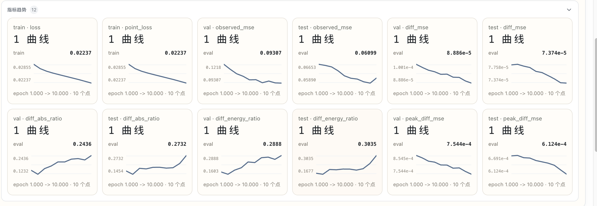

Clicking a metric expands it in place so the full chart remains readable while
the rest of the grid stays nearby:

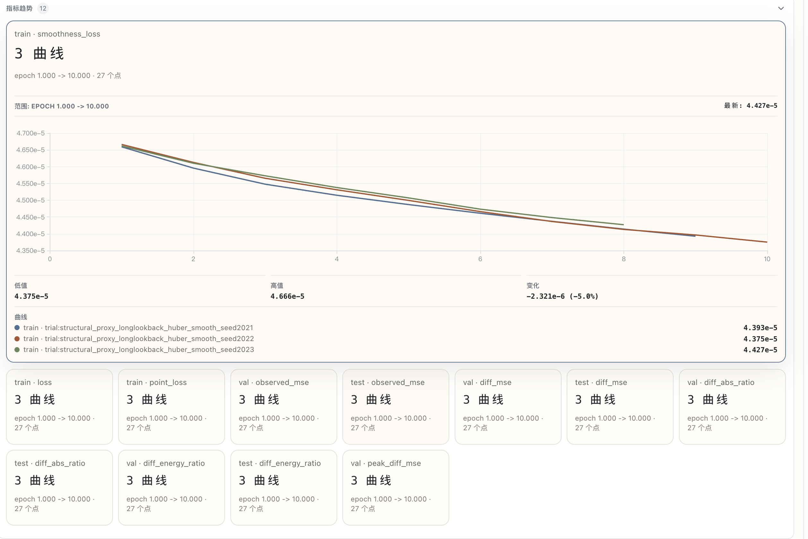

Run parameters are rendered as dense aligned cards instead of raw JSON:

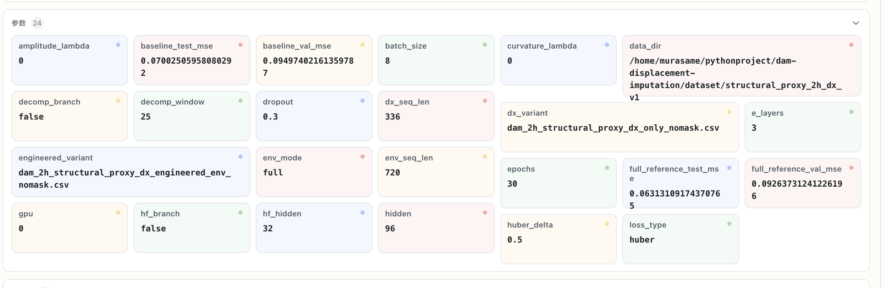

Runs that emit the same metric names can be compared on one chart:

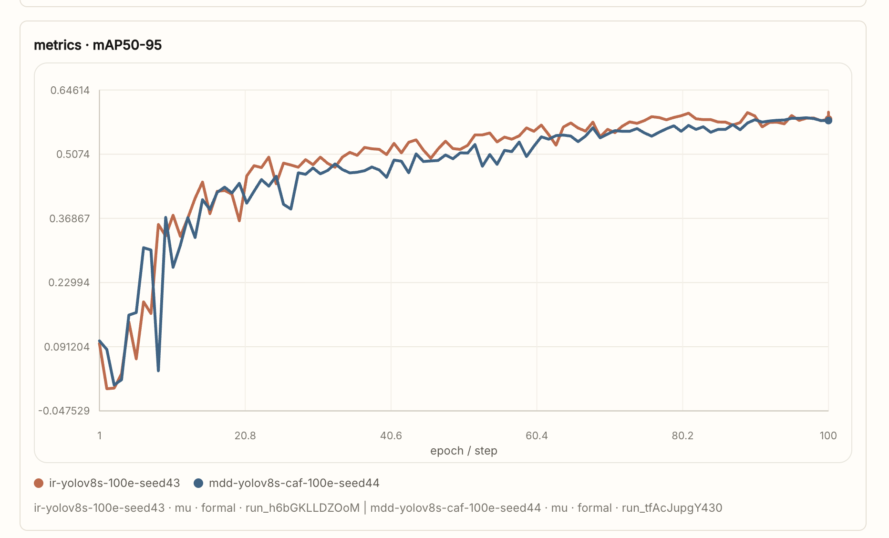

### Web Dashboards

`aexp serve` embeds two browser frontends:

- `http://localhost:8080/ui-v2/` is the recommended React/TypeScript UI. It is
  where new experiment workflows land first: high-density run browsing,
  structured event dashboards, metric cards, matrices, and Evidence Chain
  whiteboards.
- `http://localhost:8080/` is the legacy HTML dashboard. It remains available as
  a stable compatibility/debug entrypoint for older deployments and scripts that
  assume the server root opens a UI.

The legacy dashboard includes a visible entry back to React UI v2, and React UI
v2 keeps a Legacy UI link in its sidebar.


It includes:

- resource cards with CPU/RAM/GPU snapshots
- run list and run details
- live stdout/stderr/terminal logs
- virtualized run and exec tables in `/ui-v2`
- worker-backed UI event parsing and metric charts in `/ui-v2`
- evidence-chain whiteboards for manual hypothesis, run, plan, note, and
  conclusion linking

Build the React dashboard when changing frontend code:

```bash
pnpm --dir web install
pnpm --dir web build
go build -o aexp ./cmd/aexp
```
- structured progress and metrics
- Project journal entries linked to zero or more Runs

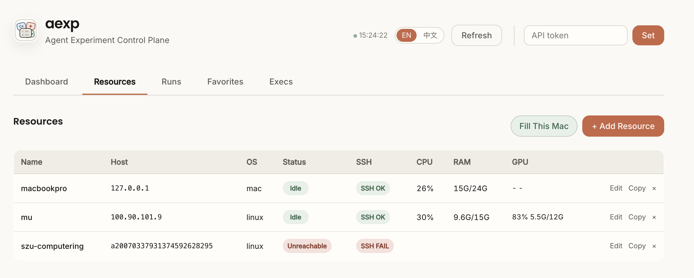

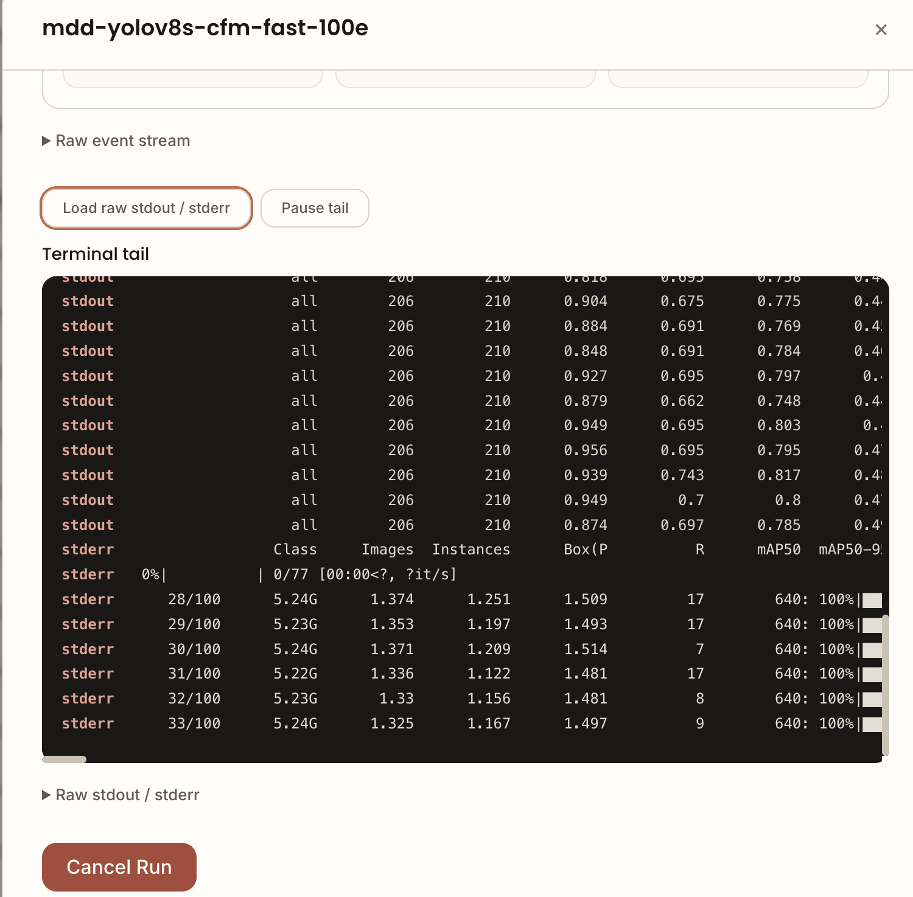

Agents and humans record reasoning in the Project journal and may link the Runs
that informed a decision. Historical RunMark records remain readable from the
Run raw view:

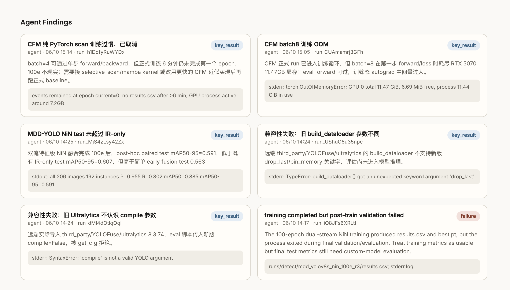

## CLI Overview

```text
aexp init
aexp serve [--port 8080] [--daemon]
aexp mcp
aexp mcp install [--target codex|claude|hermes|all]
aexp mcp uninstall [--target codex|claude|hermes|all]

aexp resource explore <host>
aexp resource add --name <name> --host <host> --root-dir <dir>
aexp resource list [--json] [--verbose]
aexp resource update <name> ...
aexp resource remove <name>

aexp exec --resource <name> -- <command>
aexp run submit --resource <name> --project <project_id> [flags] -- <program> [args...]
aexp run project set <run_id> --project <project_id> [--expected-project <old_project_id>] [--reason <text>]
aexp run list [--json]
aexp run status <run_id> [--short] [--json]
aexp run snapshot <run_id> [--json]
aexp run events <run_id> [--tail 50] [--json]
aexp run metrics <run_id> [--latest] [--json]
aexp run logs <run_id> [--follow] [--source stdout|stderr]
aexp run cancel <run_id>

aexp project init
aexp project doctor
aexp project journal list <project_id> [--run <run_id>]
aexp project journal create <project_id> --title ... --body-md-file notes.md [--run <run_id>] [--next-action ...]
aexp project sync
aexp project run <recipe>

aexp sync doctor --resource <name> <source> <target>
aexp sync push --resource <name> <source> <target>
aexp sync pull --resource <name> <source> <target>
```

For the full command reference, see [USAGE.md](USAGE.md).

## MCP For Agents

`aexp` can run as a stdio MCP server:

```bash
aexp mcp
```

To register it with local agent clients:

```bash
# Install/update Codex, Claude Code, and Hermes Agent MCP configs.
aexp mcp install --target all

# Or install one client only.
aexp mcp install --target codex
aexp mcp install --target claude
aexp mcp install --target hermes

# Remove the generated config.
aexp mcp uninstall --target all
```

The installer uses the clients' own MCP CLIs (`codex mcp ...`,
`claude mcp ...`, and `hermes mcp ...`) and manages only the server named
`aexp`. By default it points the MCP server at the current `aexp` binary and
sets `AEXP_API_URL=http://127.0.0.1:8080/api/v1`. Hermes Agent custom MCP
servers receive that environment through `/usr/bin/env ... aexp mcp`, matching
Hermes' `--command ... --args ...` install style.

The MCP server exposes structured tools for agents:

- `aexp_agent_card`
- `aexp_init`
- `aexp_project_init`
- `aexp_list_resources`
- `aexp_storage_stat`
- `aexp_storage_list`
- `aexp_storage_locations`
- `aexp_storage_copy`
- `aexp_doctor`
- `aexp_resource_explore`
- `aexp_resource_add`
- `aexp_resource_add_local`
- `aexp_resource_update`
- `aexp_resource_remove`
- `aexp_exec`
- `aexp_submit_run`
- `aexp_assign_run_project`
- `aexp_list_runs`
- `aexp_refresh_runs`
- `aexp_get_run_status`
- `aexp_get_run_snapshot`
- `aexp_tail_run_events`
- `aexp_get_run_metrics`
- `aexp_latest_run_metrics` (alias)
- `aexp_tail_run_logs`
- `aexp_cancel_run`
- `aexp_create_project_journal_entry`
- `aexp_list_project_journal`
- `aexp_get_project_journal_entry`
- `aexp_update_project_journal_next_action`
- `aexp_list_evidence_chains`
- `aexp_create_evidence_chain`
- `aexp_get_evidence_chain`
- `aexp_add_evidence_node`
- `aexp_add_evidence_edge`
- `aexp_list_matrices`
- `aexp_create_matrix`
- `aexp_get_matrix`
- `aexp_set_matrix_cell`
- `aexp_exec_history`
- `aexp_exec_show`
- `aexp_project_detect`
- `aexp_project_doctor`
- `aexp_project_run`
- `aexp_project_sync`
- `aexp_sync_doctor`
- `aexp_sync_push`
- `aexp_sync_pull`
- `aexp_sync_remote_pull`
- `aexp_cli`

The current implementation wraps the local `aexp` binary instead of duplicating
executor logic. That keeps behavior identical to the CLI: short commands still
use `aexp exec`, including the local API fast path that can reuse a warm
`aexp serve` SSH pool, while long tasks go through tracked `run submit`.
For active training, agents should monitor `aexp_get_run_snapshot`,
`aexp_tail_run_events`, or `aexp_get_run_metrics` first; raw stdout/stderr logs
are for debugging failures, OOMs, hangs, or missing events. Poll snapshots every
30-60 seconds, then back off toward 120 seconds when progress has not changed.
Evidence Chain tools expose the research whiteboard as a semantic graph for
agents. Use `aexp_get_evidence_chain` to read compact nodes and typed edges
(`run_id`, short intro, project-card summary, mark titles/statements), then use
the run tools to inspect any run in detail. Agents may create note,
hypothesis, experiment, plan, conclusion, or run nodes and link them with typed
edges, but should not arrange the board: new nodes only receive a simple
non-overlapping starting position so a human can place the UI later.

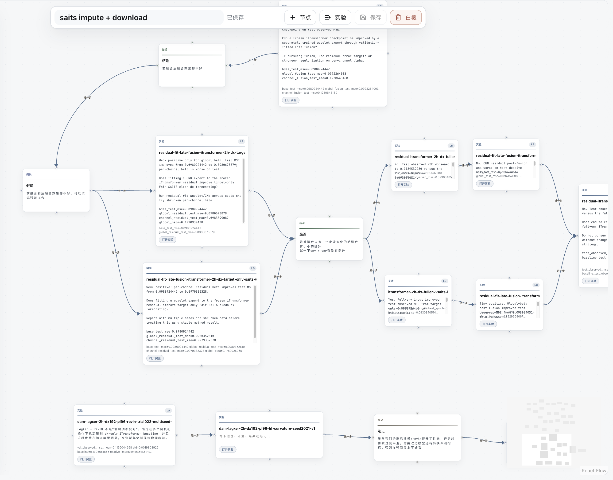

`aexp_cli` is a compatibility escape hatch for the full `aexp` CLI, including
mutating operations such as `run cancel`, `run submit`, `sync push`, and
`resource update`. It only blocks commands that would hang the MCP process
itself (`serve`, `mcp`, and unbounded `--follow`). Prefer the dedicated tools
for common workflows because their schemas are easier for agents to call
correctly, but the generic CLI path is intentionally not read-only.

## Data Model

`aexp` stores its local control-plane state in SQLite:

```text
~/.aexp/aexp.db
```

Remote run files live under the registered resource root:

```text
<root-dir>/.aexp/runs/<run_id>/
  command.sh
  status
  exit_code
  started_at
  finished_at
  logs/
    stdout.log
    stderr.log
    terminal.log
```

## Safety Model

`aexp` is a personal or small-team research tool, not a multi-tenant scheduler.

- It executes commands as the SSH user you configured.
- `--cwd` is constrained under the resource `root_dir` for aexp-managed paths.
- Dangerous command patterns such as `rm -rf /` are rejected.
- Localhost browser access is convenient by default; remote access requires the
  API token.
- Binding `aexp serve --host 0.0.0.0` exposes the service. Put it behind SSH,
  a VPN, or another trusted access layer.

## Documentation

- [USAGE.md](USAGE.md): full user guide and command examples
- [docs/concepts.md](docs/concepts.md): resources, runs, snapshots, events
- [docs/development.md](docs/development.md): architecture, implementation notes, module map
- [docs/deployment.md](docs/deployment.md): daemon and deployment notes
- [docs/testing.md](docs/testing.md): build and smoke testing workflow
- [docs/mod-security.md](docs/mod-security.md): security boundaries
- [docs/mod-api.md](docs/mod-api.md): REST and WebSocket API
- [docs/mod-agent.md](docs/mod-agent.md): MCP tool surface

## Development

```bash
go test ./...
go build -o aexp ./cmd/aexp
```

This repository intentionally keeps the binary self-contained: Go backend,
embedded HTML/CSS/JS dashboard, SQLite storage, and no Node build pipeline.

## Status

`aexp` is early-stage software built from real research workflow pain. It is
useful today for SSH-based experiment tracking, but expect rough edges around
multi-user deployments, non-SSH backends, and integration with external
experiment trackers.

Contributions that improve reliability, documentation, provider support, and
agent-oriented workflows are welcome.
