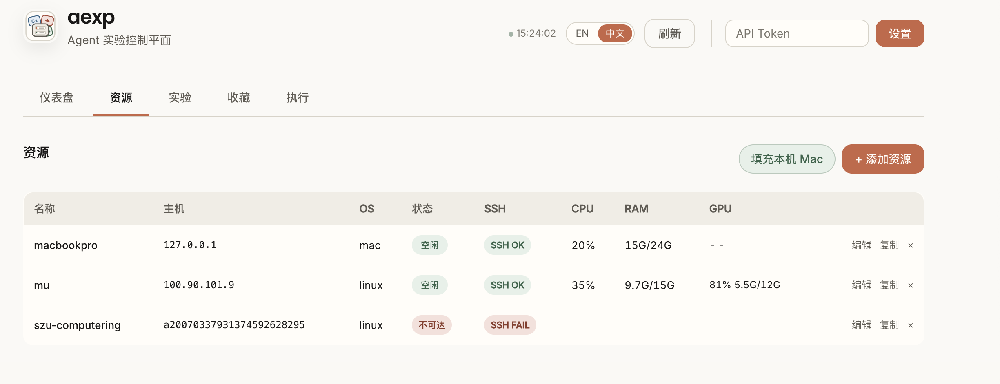

# aexp

[](https://go.dev/)
[](https://github.com/murasame612/aexp/releases)
[](https://github.com/murasame612/aexp/releases)

[English](README.md) | [中文](README_zh.md)

面向人和 Agent 的实验控制平面。

`aexp` 是一个用 Go 写的单文件工具，用来把远程 SSH 机器上的科研实验跑得更稳、更可追踪。它保留 SSH 的直接感，同时补上 run 记录、tmux 后台执行、资源监控、结构化指标、日志查看、项目配置和 MCP 工具。


## 为什么需要 aexp？

很多实验一开始都只是几条 SSH 命令：

- `ssh` 进机器
- `tmux` 或 `nohup` 跑训练
- 手动记日志路径
- 靠 `nvidia-smi` 看 GPU
- 过几天再从 shell history 里猜当时跑了什么

人还能勉强记住上下文，Agent 更容易丢：它不知道之前在哪台机器、哪个目录、哪个 Python、哪个 GPU 上提交了什么，也不知道结果和日志在哪里。

`aexp` 把这些动作变成一层很薄的控制面：

| 需求 | 裸 SSH | aexp |
|---|---|---|
| 短检查 | `ssh host ...` | `aexp exec --resource gpu -- ...` |
| 长实验 | 手写 `tmux` / `nohup` | `aexp run submit ...` |
| 找日志 | 靠记忆和路径 | `aexp run logs <run_id>` |
| 看指标 | grep 日志 / 读 csv | `aexp run snapshot/events/metrics` |
| 看资源 | 远端命令 | Web 面板资源卡片 |
| Agent 接管 | 重新读上下文 | MCP 工具 + run/project 记录 |
| 区分 setup/smoke/formal | 靠命名约定 | 一等 `--kind setup|smoke|formal|ablation` |

一句话：

```text
resource = 去哪台机器
project  = 这个项目怎么同步、进环境、跑命令
run      = 这一次到底跑了什么
```

## 功能概览

- 注册 SSH 资源：root 目录、默认 Conda 环境、GPU 编号、SOCKS 代理、ProxyCommand。
- 用 tmux 在远端提交长时间 run，并记录 stdout、stderr、terminal log、exit code 和时间戳。
- 用 `exec` 跑短命令，不污染实验记录。
- 自动识别项目环境：`.venv`、`uv run`、Conda、Python、Torch、CUDA、日志和指标候选路径。
- 用 rsync 同步项目代码和数据，支持默认排除 `.venv`、训练输出和缓存。
- 用 JSONL 事件记录 progress、metric、param、note，前端直接显示进度条和图表。
- 支持 Codex / Claude Code MCP，让 Agent 不需要手写 SSH 和 JSON 配置。
- 本地 SQLite 存储资源、run、事件、标注和执行历史。

## 安装

### 二进制安装

```bash
curl -fsSL https://raw.githubusercontent.com/murasame612/aexp/main/scripts/install.sh | sh
aexp --help
```

安装脚本会从 GitHub Release 下载当前系统和架构对应的二进制，并安装到 `~/.local/bin`：

- `aexp`
- `aexp-event`

安装指定版本或目录：

```bash
AEXP_VERSION=v0.1.0 sh -c "$(curl -fsSL https://raw.githubusercontent.com/murasame612/aexp/main/scripts/install.sh)"
AEXP_INSTALL_DIR=/usr/local/bin sh -c "$(curl -fsSL https://raw.githubusercontent.com/murasame612/aexp/main/scripts/install.sh)"
```

后续更新或卸载：

```bash
aexp update
aexp update --stop-serve
aexp uninstall --yes
aexp uninstall --yes --purge-data
```

`aexp update` 会下载当前系统/架构对应的 GitHub Release，校验
`checksums.txt`，用 `--version` 做一次冒烟验证，备份旧二进制后替换，并重建
`aexp-event` 兼容入口。`aexp uninstall` 默认删除二进制和 MCP 客户端配置，但保留
`~/.aexp`；只有显式传入 `--purge-data` 才会删除本地数据库、日志和缓存。

### 从源码构建

```bash
git clone https://github.com/murasame612/aexp.git
cd aexp
go build -o aexp ./cmd/aexp
./aexp --help
```

远端机器不需要安装 `aexp`，只需要：

- 本机能 SSH 到远端
- 远端有 `bash`
- 远端有 `tmux`
- 项目自己的运行环境，比如 Python、uv、Conda、CUDA
- 可选：`rsync`，用于项目同步

## 快速开始

初始化本地状态并启动 Web 面板：

```bash
aexp init
aexp serve --port 8080
```

打开：

```text
http://localhost:8080
```


如果你使用 Codex、Claude Code 或 Hermes Agent，安装 MCP 工具：

```bash
aexp mcp install --target all
```

这样 Agent 可以直接调用 `aexp_exec`、`aexp_submit_run`、`aexp_project_run`、`aexp_sync_push`、`aexp_mark_run` 等结构化工具，不需要自己拼 SSH 命令。

## 添加远程资源

先探索一台 SSH 机器：

```bash
aexp resource explore 192.168.1.100 --user root
```

添加资源：

```bash
aexp resource add \
  --name gpu-box \
  --host 192.168.1.100 \
  --user root \
  --root-dir /workspace \
  --conda-env research \
  --gpu-indices 0
```

也可以在网页里添加：


资源卡片会显示 CPU、内存、GPU 显存和利用率：



## exec：短命令

`exec` 适合 10-30 秒内结束的检查命令，比如：

```bash
aexp exec --resource gpu-box -- hostname
aexp exec --resource gpu-box -- nvidia-smi
aexp exec --resource gpu-box --cwd /workspace/project --project-env auto -- 'python -V'
```

不要用 `exec` 跑训练、安装依赖、生成大数据集或长时间 tail 日志。长任务应该走 `run submit`。

## run：长时间任务

提交正式实验：

```bash
aexp run submit \
  --resource gpu-box \
  --name ecl-itransformer \
  --kind formal \
  --cwd /workspace/Time-Series-Library \
  --project-env auto \
  --gpu-index 0 \
  --log-paths 'logs/**/*.log' \
  --metric-paths 'results/**/*.json' \
  -- python train.py --data ECL --model iTransformer
```

查看 run：

```bash
aexp run list
aexp run snapshot run_xxx --json
aexp run events run_xxx --tail 50 --json
aexp run logs run_xxx --tail 100
```

Web 面板会显示 run 类型、状态、GPU、命令、收藏、回收站和高亮标注：


`kind` 很重要：

```bash
aexp run submit --kind setup --no-gpu --resource gpu-box --shell -- 'uv sync'
aexp run submit --kind smoke --resource gpu-box -- python train.py --epochs 1
aexp run submit --kind formal --resource gpu-box -- python train.py --epochs 100
```

`setup` 和 `smoke` 不是正式实验结果，不要在论文或总结里当作证据。

## project：项目级封装

如果一个项目会反复在同一台机器、同一个目录、同一个环境里运行，可以放一个 `.aexp.yaml`：

```bash
aexp project init --resource gpu-box --cwd /workspace/project
aexp project doctor
aexp project sync --dry-run
aexp project sync
aexp project run setup --dry-run
aexp project run train
```

`project` 不是新的训练框架，它更像一个很薄的命令菜谱：

- 默认 resource
- 默认 cwd
- 默认 env
- sync 规则
- 常用 recipe
- logs / metrics / artifacts 路径

参考 [examples/python-ml](examples/python-ml)。

## 结构化事件和图表

`run submit` 会设置这些环境变量：

- `AEXP_RUN_ID`
- `AEXP_RUN_DIR`
- `AEXP_UI_EVENTS`

Python 脚本可以写事件：

```python
from aexp_events import metric, progress, param, note

param("model", "iTransformer")
progress("epoch", current=1, total=20, series="iTransformer/raw", stage="train")
metric("val/loss", 0.123, step=1, series="iTransformer/raw", split="val")
note("first checkpoint written")
```

事件名字要短而稳定，例如 `train/loss`、`val/mse`、`epoch`、`trial`。
不要把完整模型配置、数据集路径、trial id 塞进指标名里；这些上下文应该
放在 `series`、`variant`、`split`、`stage`、`trial` 这类字段里。

超参数搜索建议这样写，同一个 loss 名字会在同一张图里解析成不同 trial 曲线：

```python
for trial_id, cfg in enumerate(search_space):
    param("learning_rate", cfg.lr, trial=trial_id)
    progress("trial", current=trial_id + 1, total=len(search_space))
    for epoch in range(max_epochs):
        progress("epoch", current=epoch + 1, total=max_epochs, trial=trial_id, stage="train")
        metric("train/loss", train_loss, epoch=epoch + 1, trial=trial_id)
        metric("val/loss", val_loss, epoch=epoch + 1, trial=trial_id, split="val")
```

前端会把这些事件显示成进度卡、指标卡和图表：


点击某个指标后，它会在当前位置展开成大图，其他指标仍然保留在同一组网格里：


参数会显示成高密度、对齐的小卡片，而不是一坨 JSON：


`aexp run snapshot`、`aexp run events`、MCP 事件工具和 Web UI 只要成功读到
run 的 UI event 文件，就会把这份 JSONL 镜像到本机
`~/.aexp/event_cache/<run_id>.jsonl`。如果远端资源后来离线，或者临时容器消失，
事件读取会回退到本机缓存，同时把原始远端读取错误一起返回。

多个 run 只要写了同名指标，就可以放到同一张图里比较：


对 Agent 来说，正常监控应该优先读事件，而不是狂刷日志：

```bash
aexp run snapshot run_xxx --json
aexp run metrics run_xxx --latest --json
aexp run events run_xxx --tail 50 --json
```

stdout/stderr 更适合失败、OOM、卡住或缺少事件时诊断：


## Agent 标注

Agent 或人可以给重要 run 写标注：

```bash
aexp run mark run_xxx \
  --title "IR baseline still stronger" \
  --reason "mAP50-95 beats fusion baseline" \
  --evidence "events + results.csv"
```

有标注的 run 会在列表里高亮，避免上下文丢失后忘记关键发现：


## MCP 工具

`aexp` 可以作为 stdio MCP server：

```bash
aexp mcp
```

安装到本地 Agent 客户端：

```bash
aexp mcp install --target all
aexp mcp install --target codex
aexp mcp install --target claude
aexp mcp install --target hermes
```

常用工具包括：

- `aexp_agent_card`
- `aexp_exec`
- `aexp_submit_run`
- `aexp_project_run`
- `aexp_sync_push`
- `aexp_get_run_snapshot`
- `aexp_tail_run_events`
- `aexp_get_run_metrics`
- `aexp_tail_run_logs`
- `aexp_mark_run`
- `aexp_get_evidence_chain`
- `aexp_add_evidence_node`
- `aexp_add_evidence_edge`
- `aexp_get_matrix`
- `aexp_set_matrix_cell`

建议 Agent 的默认策略：

```text
短检查：aexp_exec
长任务：aexp_submit_run
项目复用：aexp_project_run
正常监控：aexp_get_run_snapshot / aexp_tail_run_events
失败诊断：aexp_tail_run_logs
关键结论：aexp_mark_run
```

证据链白板会把假说、实验 run、计划、结论和笔记放成可连线的研究推理图；Agent 可以读写语义节点和边，但具体排版仍然留给人调整：


## 安全边界

`aexp` 是个人或小团队科研工具，不是多租户调度系统。

- 命令以你配置的 SSH 用户身份执行。
- `--cwd` 会限制在 resource 的 `root_dir` 下。
- 会拒绝明显危险的命令模式，例如 `rm -rf /`。
- localhost 访问默认免 token；非本地访问需要 server 打印的 API token。
- 如果用 `aexp serve --host 0.0.0.0` 暴露服务，请放在 SSH、VPN 或可信访问层后面。

## 文档

- [USAGE.md](USAGE.md)：完整使用指南和命令示例
- [docs/concepts.md](docs/concepts.md)：resource、run、snapshot、event 概念
- [docs/development.md](docs/development.md)：架构和模块说明
- [docs/deployment.md](docs/deployment.md)：daemon 和部署
- [docs/testing.md](docs/testing.md)：测试和 smoke workflow
- [docs/mod-security.md](docs/mod-security.md)：安全边界
- [docs/mod-api.md](docs/mod-api.md)：REST 和 WebSocket API
- [docs/mod-agent.md](docs/mod-agent.md)：MCP 工具面

## 开发

```bash
go test ./...
go build -o aexp ./cmd/aexp
```

这个仓库刻意保持简单：Go 后端、嵌入式 HTML/CSS/JS 前端、SQLite 存储，没有 Node 构建流程。

## 状态

`aexp` 还在早期阶段，但已经能解决真实 SSH 实验工作流里的很多痛点。它适合个人和小团队把远程实验跑得更可追踪，也适合让 Agent 少猜环境、少刷日志、少丢上下文。
