# PRD：Zotero → LightRAG 研究文献检索 v1

状态：Superseded（2026-08-04）。默认产品方案已收口到
[prd-aexp-literature-retrieval-v1.md](prd-aexp-literature-retrieval-v1.md)；LightRAG 仅保留为历史试验。

版本：1.0

日期：2026-08-03

配套验收标准：
[acceptance-zotero-lightrag-v1.md](acceptance-zotero-lightrag-v1.md)

适用范围：macOS Zotero、不可变语料快照、mu、LightRAG、Agent 检索、ResearchOS Journal / Evidence Proposal

## 1. 摘要

本项目为 Agent 提供一个可追溯、可重建、可降级的个人研究文献检索层：

```text
Mac Zotero
→ 不可变 Corpus Revision
→ mu 上的 LightRAG 派生索引
→ 带来源定位的检索证据
→ Agent 推理
→ ResearchOS Journal / Evidence Proposal
```

关键决策如下：

- Mac Zotero 是唯一交互式文献事实源；
- Linux 虽有官方 Zotero 桌面版，但 v1 不在 mu 运行第二个 Zotero GUI；
- mu 只保存可从 Corpus Revision 重建的派生索引，不成为第二个文献库；
- Zotero 高光、笔记和 PDF 全文是同一语料的不同证据层，必须保留 Zotero item、附件、标注和页码身份；
- LightRAG 只负责发现与检索文献关系，不等同于 ResearchOS Evidence Map，也不得直接写入正式研究结论；
- v1 先作为 shadow backend 与 BM25 + dense 基线对照；未通过验收不得替代默认检索。

## 2. 为什么不在 mu 部署 Zotero GUI

Zotero 官方支持 Linux，但其 Linux 版本仍是桌面客户端。Local API 由正在运行的桌面应用在
`localhost:23119` 提供；它不是独立无头服务。

在 mu 再运行一套 Zotero 会引入第二个同步写者、GUI/display 生命周期、附件同步和冲突处理，
却不能提高索引真实性。v1 因而明确禁止：

- 在 mu 运行第二个 Zotero GUI/profile；
- rsync 或云同步正在使用的 Zotero data directory；
- 直接复制 live `zotero.sqlite`；
- 让 mu 回写 Zotero 数据或假装拥有最新文献状态。

Linux Zotero 只在未来需要 Linux 人工阅读工作站时重新评估，不属于检索服务依赖。

## 3. 产品边界与术语

### 3.1 Zotero Source

Mac 上由用户维护的 Zotero library。它是元数据、附件归属、高光和笔记的唯一可写来源。

### 3.2 Corpus Revision

从 Zotero Source 一次性冻结的不可变语料发布，至少包含：

- `library_id` 与 `library_version`；
- 逐文件路径、大小与 SHA-256；
- item、attachment、annotation/note 的 Zotero key 和 version；
- PDF 解析器及版本；
- 每个 chunk 的内容 hash、页码/页标签和 Zotero URI；
- manifest 自身 SHA-256；
- 发布时刻、发布器版本和 warnings。

同一 manifest 内容幂等得到同一 revision；内容变化必须生成新 revision，禁止覆盖。

### 3.3 Derived Index

mu 上与单一 Corpus Revision 绑定的 LightRAG 工作区。它包含 KV、向量、图和文档状态，但
不是事实源，可以删除并重建。

### 3.4 Retrieval Evidence

一次查询返回的可引用来源集合。每条 evidence 必须能定位回具体 Zotero item、附件/标注、
页码和 chunk hash，并声明所用 Corpus Revision 和索引配置。

### 3.5 ResearchOS Journal / Evidence Proposal

Agent 使用 Retrieval Evidence 形成的研究工作日志或候选研究关系。LightRAG 不直接创建、
接受或修改 Evidence Map；正式入图继续经过 ResearchOS 的 proposal 与 provenance 门禁。

## 4. 规范架构

```mermaid
flowchart LR
    Z["Mac Zotero：唯一事实源"] --> P["Snapshot Publisher"]
    P --> C["不可变 Corpus Revision\nmanifest + chunks + hashes"]
    C --> S["mu staging workspace"]
    S --> L["LightRAG shadow index"]
    L --> V["自动校验与评测"]
    V -->|"通过"| A["active verified revision"]
    A --> Q["Agent Query API\nmix + reranker"]
    Q --> E["Retrieval Evidence\n页码级 provenance"]
    E --> J["ResearchOS Journal"]
    J --> R["Evidence Proposal / review"]
```



### 4.1 来源策略

来源优先级固定为：

1. Mac Zotero Local API：元数据、collection、标注和笔记；
2. Mac 本地附件：PDF 全文和页码保真解析；
3. Zotero Web API：远程元数据、版本差分和诊断备用。

单个 Corpus Revision 不得混合两个不同 `library_version` 的 Local/Web 响应。Mac 离线时，mu
继续服务最后一个 verified revision，并明确返回 `freshness=stale`，不得静默宣称最新。

### 4.2 发布状态机

```text
collecting
→ hashing
→ published
→ transferring
→ indexing
→ verifying
→ ready
→ active

任一操作故障 → failed，保留 stage、错误和上一 active revision
```

发布器先写临时目录，完整校验后原子提升。索引也在新 workspace 内完成，只有全部文档状态、
provenance 和回归查询通过后，才原子切换 active version pointer。失败不得破坏当前可查询版本。

v1 提供两个显式索引 profile，二者不得共用 workspace 身份：

- `shadow`：完整冻结 20–30 篇来源，但只对全部 Zotero 高光和每篇均匀抽取的少量正文 chunk
  建图，用于尽快验证真实查询、来源返回和 Agent 工作流；响应必须声明 partial index coverage；
- `full`：对冻结 revision 的全部唯一正文 chunk 建图，用于最终质量/删除/性能验收。

相同正文出现在原版、compare 副本或重复附件时，只在派生索引中确定性去重；Corpus Revision
继续保存所有来源记录及其 provenance。`shadow` 不能通过“30 篇全量索引”验收项，也不得被标为
`accepted`。

### 4.3 增量和删除

- 增量身份以 Zotero `library_version` 和对象 version 为准；mtime 只用于诊断；
- 新增、修改、删除都产生新 Corpus Revision；
- 删除对象必须写入 tombstone/差异清单；
- v1 可选择完整重建而非危险的原位局部修补；
- 切换后已删除条目、chunk、实体和关系不得继续命中；
- 回滚只切回上一 verified revision，不重写历史目录。

## 5. LightRAG v1 运行配置

v1 使用官方 LightRAG API server 的固定版本和文件型工作区：

- LightRAG：`v1.5.5` / commit `22ea2d0cbfa2b7002aa118bd0bf1780a69d489bc`；
- LLM：`gpt-5.6-luna`，OpenAI-compatible relay；
- 关系抽取：固定 prompt 版本、entity types、gleaning 次数和温度；
- Embedding：`BAAI/bge-m3` revision `5617a9f61b028005a4858fdac845db406aefb181`；
- Reranker：`BAAI/bge-reranker-v2-m3` revision `953dc6f6f85a1b2dbfca4c34a2796e7dde08d41e`；
- 默认查询：有 reranker 时使用 `mix`；
- 存储：LightRAG 默认文件后端，按 Corpus Revision 隔离 workspace；
- 网络：只监听 mu 的 WireGuard/Tailscale 地址，要求 bearer/API key；
- 成本：同时记录原价和 relay `0.05` 倍率后的实际估算。

若 BGE-M3 与 reranker 无法在 mu 的 12 GB 显存/14 GB RAM 下稳定共存，允许按请求串行装载或
把 reranker 放 CPU；不得因资源不足悄悄切换模型。最终配置必须写进 revision sidecar。

## 6. 查询合同

查询响应至少包含：

```json
{
  "answer": "...",
  "answerability": "supported | partial | unsupported",
  "retrieval_mode": "mix",
  "corpus_revision": "corpus_...",
  "snapshot_sha256": "sha256:...",
  "freshness": "fresh | stale",
  "evidence": [
    {
      "zotero_item_key": "...",
      "attachment_key": "...",
      "annotation_key": "...",
      "page": 12,
      "chunk_sha256": "...",
      "zotero_uri": "zotero://...",
      "text": "..."
    }
  ],
  "warnings": []
}
```

回答正文中的引用必须映射到 `evidence`。来源不足时必须返回 `partial/unsupported`，不得用图中
关系、模型记忆或未定位文本伪装成文献事实。

## 7. ResearchOS 集成边界

Agent 可以：

- 查询相关论文、标注、原文段落和跨论文关系；
- 将引用写入 Project Journal；
- 根据引用起草 Evidence Proposal；
- 在 proposal 中保留 corpus revision、chunk hash 和 Zotero URI。

Agent 和 LightRAG 不可以：

- 自动把文献关系当成项目 Evidence Map 的 accepted edge；
- 把 LightRAG 的 entity/edge ID 当作稳定科学事实；
- 用 RAG 结果替代 Run provenance、DatasetVersion 或 Freeze；
- 因检索结果相似就声称机制被实验验证。

## 8. v1 范围

### 8.1 实施

- Mac snapshot publisher；
- 逐文件 manifest、不可变 revision 和原子发布；
- 20–30 篇全文的受控试验 collection；
- mu 上官方 LightRAG shadow service；
- 固定模型/解析器/prompt 配置；
- mix 查询、reranker、provenance response；
- active revision pointer、回滚与 stale 模式；
- BM25 + dense baseline 和自动验收报告；
- Agent 只读查询接口。

### 8.2 延后

- PostgreSQL、Neo4j、Milvus 等独立数据服务；
- Web API 自动轮询；
- 多用户、共享 library 权限管理；
- 跨 revision 并行查询与对比；
- 自动写回 Zotero；
- ResearchOS 内的通用文献管理 UI。

### 8.3 删除/禁止

- mu 上的第二个 Zotero GUI；
- live Zotero 数据目录同步；
- LightRAG 直写 accepted Evidence Map；
- 将现有 prototype-hybrid 服务改名后冒充 LightRAG；
- 未经过基线对照就把 shadow backend 设为默认。

## 9. 决策共识

2026-08-03，Codex 与 Kimi K3 对上述十项边界达成 `CONSENSUS=YES`。Kimi 要求并已纳入：

1. 在 pilot 前冻结可证伪的评测集和量化门槛；
2. 钉死 LightRAG、模型、PDF 解析器、抽取 prompt 与 gleaning 版本；
3. 把删除零幽灵命中、原子切换和回滚演练列为硬验收；
4. 禁止 Local API 与 Web API 在同一 revision 中形成半新半旧快照。

## 10. 参考事实

- Zotero Linux 安装：<https://www.zotero.org/support/installation>
- Zotero Local API：<https://www.zotero.org/support/dev/web_api/v3/local_api>
- Zotero Web API / version：<https://www.zotero.org/support/dev/web_api/v3/basics>
- Zotero Sync：<https://www.zotero.org/support/sync>
- LightRAG：<https://github.com/HKUDS/LightRAG>
- LightRAG API server：<https://github.com/HKUDS/LightRAG/blob/main/docs/LightRAG-API-Server.md>
